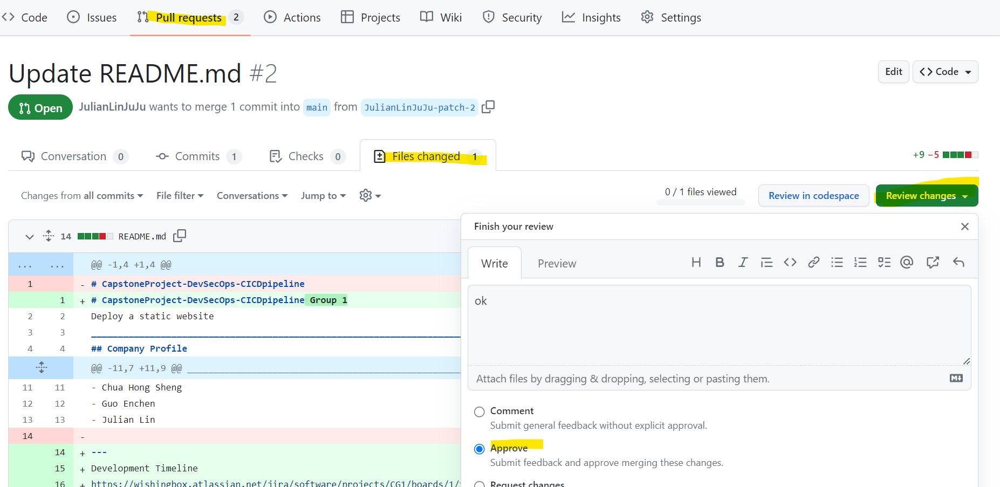

# CapstoneProject-DevSecOps-CICDpipeline Group 1
Deploy a static website

_______________________________________________________________________________________
## Company Profile
  WebSolve is a company that specializes in creating customized administrative software solutions for various industries and domains. WebSolve helps its clients to solve their business challenges and achieve their goals by designing, developing and deploying tailor-made software applications that meet their specific needs and requirements. WebSolve aims to deliver effective solutions that not only help administrators meet their project/daily tasks, but also ensure data quality and efficiency for data collections. With our digitalization and optimization services, we help our clients streamline their workflows and processes, and make the most of their data. WebSolve’s vision is to become a leading provider of customized software solutions in the asia region.

  The application websites will be used to show some use cases and let interested consumers to subscribe to our newletters or contact our friendly staff for more information.

## The Team Consist of:
- Chua Hong Sheng
- Guo Enchen
- Julian Lin
---
Development Timeline
https://wishingbox.atlassian.net/jira/software/projects/CG1/boards/1/timeline?selectedIssue=CG1-14&timeline=WEEKS

_______________________________________________________________________________________
## Getting started

_______________________________________________________________________________________
## Dependencies

_______________________________________________________________________________________
## Application Structure

S3 Bucket for web hosting
- after creation of s3 bucket, go into: 
   - properties -> ensure Static website hosting is enabled
   - permissions -> ensure bucket policy is made public 
   - bucket name: group1-staticwebsite-bucket123321
{
    "Version": "2012-10-17",
    "Statement": [
        {
            "Sid": "PublicReadmeGetObject",
            "Effect": "Allow",
            "Principal": "*",
            "Action": "s3:GetObject",
            "Resource": "arn:aws:s3:::group1-staticwebsite-bucket123321/*"
        }
    ]
}

_______________________________________________________________________________________
## Branching Strategies
Production Branch
- [url](https://github.com/Group1-SCTPCloud/CapstoneProject-DevSecOps-CICDpipeline)

Development Branch
- https://github.com/Group1-SCTPCloud/CapstoneProject-DevSecOps-CICDpipeline/tree/dev

Feature Branch
<url>

_______________________________________________________________________________________
## Security

Branch protection rule activation for github
For Main and Dev Branch: 
- setting > branch > branch protection rule > add a new rule > 
 -select the branch to protect
 -Enabled "require a pull request before merging"
 -Enabled "require approval"
 -Enabled "require status checks to pass before merging"

For Main Branch:
 ( should we also enable "Require review from Code Owners"? )

- Enabled "Secrets scanning and push protection"
- Enabled "Do not allow bypassing the above settings in main branch"
_______________________________________________________________________________________

Secrets - add

Added AWS access keys to Github secrets for reference, variable name to use:
- AWS_ACCESS_KEY_ID
- AWS_SECRET_ACCESS_KEY

_______________________________________________________________________________________
## Security

_______________________________________________________________________________________

**Key Roles**
Web Developer 
DevOps 
Cloud Engineer 

Slides should include :
- Program for Deployment
- Lesson learnt
- Improvements

_______________________________________________________________________________________
## CICD Pipeline

Create New Project 
Create 2 new repositories on GitHub and assign appropriate access to the group members as collaborators based on their role.
Web application repository 
Backend AWS configuration repository

Create Static Web Application (S3) 
Create 2 versions of a static website to be hosted on S3 to simulate a working CD pipeline

Application is deployed to AWS.

Write CD pipeline
A CD script should be written with Github actions The static webpages can be built, tests can be run, and the application can be deployed using the CD script. 

Proper authentication and authorization are to be ensured in each environment in the CD Script, with the condition that credentials used for deploying development and production environments should not be the same.

Proper handling of CICD Pipeline Secrets is to be carried out.

-  Master Branch is secured
-  Work with Pull Request & Merging
-  Create new Role on AWS and use the secret into Github, Not User
-  Get Key from AWS

Write the Terraform script to be used in the CD pipeline.
- Create a S3 bucket for storage of Terraform state
-  Ensure that the .tf state file is stored remotely in a S3 bucket
-  Terraform script should replace the old version of the static website within the same bucket.

_Resources_
- https://blog.awsfundamentals.com/using-s3-with-terraform

- https://www.freecodecamp.org/news/ui-ux-design-tutorial-from-zero-to-hero-with-wireframe-prototype-figma/

- Creating S3 Website with Github actions
  - https://towardsaws.com/deploy-a-serverless-static-website-in-aws-s3-and-cloudfront-using-github-actions-a1174dec10d4
  - https://dev.to/johnkevinlosito/deploy-static-website-to-s3-using-github-actions-4a0e

- approval process

- merge after approval
**Key Roles**
Web developer 
DevO ps 
Cloud Engineer 
---
_Resources_
https://blog.awsfundamentals.com/using-s3-with-terraform

https://www.freecodecamp.org/news/ui-ux-design-tutorial-from-zero-to-hero-with-wireframe-prototype-figma/

Creating S3 Website with Github actions
https://towardsaws.com/deploy-a-serverless-static-website-in-aws-s3-and-cloudfront-using-github-actions-a1174dec10d4
https://dev.to/johnkevinlosito/deploy-static-website-to-s3-using-github-actions-4a0e

_______________________________________________________________________________________

