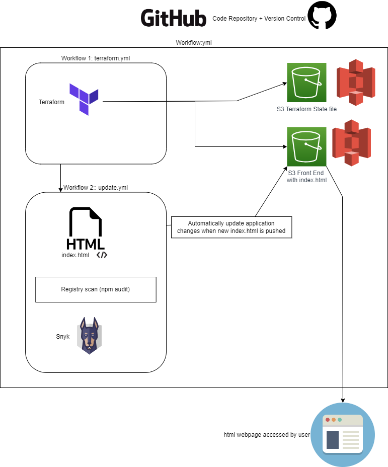

# CapstoneProject-DevSecOps-CICDpipeline Group 1
Deploy a static website

Slides: https://docs.google.com/presentation/d/1gCoV5thRjCZjEN5Ua7M2DI2eb4gKK3Qqd1c0f05PKLk/edit#slide=id.g27c64f68ca6_0_14

_______________________________________________________________________________________
## Company Profile
  WebSolve is a company that specializes in creating customized administrative software solutions for various industries and domains. WebSolve helps its clients to solve their business challenges and achieve their goals by designing, developing and deploying tailor-made software applications that meet their specific needs and requirements. WebSolve aims to deliver effective solutions that not only help administrators meet their project/daily tasks, but also ensure data quality and efficiency for data collections. With our digitalization and optimization services, we help our clients streamline their workflows and processes, and make the most of their data. WebSolve’s vision is to become a leading provider of customized software solutions in the asia region.

  The application websites will be used to show some use cases and let interested consumers to subscribe to our newletters or contact our friendly staff for more information.

  Link: https://group1-staticwebsite-bucket123321.s3.ap-southeast-1.amazonaws.com/index.html


## The Team Consist of:
- Chua Hong Sheng
- Guo Enchen
- Julian Lin
---
Development Timeline
https://wishingbox.atlassian.net/jira/software/projects/CG1/boards/1/timeline?selectedIssue=CG1-14&timeline=WEEKS

_______________________________________________________________________________________
## Getting started

To host a simple HTML file on an S3 static website, you can use a CI/CD pipeline to create an S3 bucket using Terraform. The newest index.html file from this GitHub repository can then be uploaded and automatically updated whenever there is a push to any branch.

_______________________________________________________________________________________
## Dependencies

- npm
- AWS S3 bucket
- Snyk
- Terraform

_______________________________________________________________________________________
## Application Structure

**workflow to run one after another**

- to use a new <workflow>.yml file: 
    - add workflow dispatch
    - add  call-workflow1:
    -       call-workflow2:
    - add secrets to be inherit

    - note that there cannot be more than 3 workflow, not supported


**s3 bucket**
```
S3 Bucket for web hosting
- after creation of s3 bucket, go into: 
   - properties -> ensure Static website hosting is enabled
   - permissions -> ensure bucket policy is made public 
   - bucket name: group1-staticwebsite-bucket123321
{
    "Version": "2012-10-17",
    "Statement": [
        {
            "Sid": "PublicReadmeGetObject",
            "Effect": "Allow",
            "Principal": "*",
            "Action": "s3:GetObject",
            "Resource": "arn:aws:s3:::group1-staticwebsite-bucket123321/*"
        }
    ]
}
```


_______________________________________________________________________________________
### Architecture Diagram




_______________________________________________________________________________________
## Branching Strategies
Production Branch (main)
- [url](https://github.com/Group1-SCTPCloud/CapstoneProject-DevSecOps-CICDpipeline)

Development Branch (dev)
- [url](https://github.com/Group1-SCTPCloud/CapstoneProject-DevSecOps-CICDpipeline/tree/dev)

Feature Branch (feature)
- [url](https://github.com/Group1-SCTPCloud/CapstoneProject-DevSecOps-CICDpipeline/tree/feature)

_As we uses simple html code, we have only a dev branch then to production branch_
_______________________________________________________________________________________
## Security


**Branch protection rule activation for github**

For Main and Dev Branch:

- setting > branch > branch protection rule > add a new rule > 
  - select the branch to protect
  - Enabled "require a pull request before merging"
  - Enabled "require approval"
  - Enabled "require status checks to pass before merging"

For Main Branch:

- Enabled "Secrets scanning and push protection"
- Enabled "Do not allow bypassing the above settings in main branch"

(we can also add should we also enable "Require review from Code Owners")

**Added Vulnerability Scan**

- Snyk 
- npm audit

_______________________________________________________________________________________

## Secrets 

Added AWS access keys to Github secrets for reference, variable name to use:
- AWS_ACCESS_KEY_ID
- AWS_SECRET_ACCESS_KEY
- BUCKET_TF_STATE
- SNYK_TOKEN

_______________________________________________________________________________________

**Key Roles**
- Web Developer 
- DevOps 
- Cloud Engineer 


### Lessons Learnt
- When working with multiple that are dependent on GitHub actions secrets, the use of `secrets: inherit` should be included in the main workflow to ensure workflows downstream have access to secrets.

- When using composite workflow: eg call_workflow, cannot have more than 3 workflows. 

- When using composite workflow: github secrets needs to be inherited, stated in Workflow.yml under call_worflow

- If more than 1 person working on code on same branch like feature(without pull request needed to marge with code to repository), when I am working, I should always "git pull" frequently to see what are the changes made by others.

- If use ```git add .``` accidentally for unwanted files, use ```git reset HEAD <filename>``` instead of git stash - this makes the files not able to add into repo unless manually git add <filename> again.

### Areas for Improvements
- Can parameterize bucket names and environment attributes in Github secrets and variables instead of hard coding in Terraform script for for flexibility

- Can use container to get all the advance features for index.html to look professional with CSS.

- 

_______________________________________________________________________________________
## CICD Pipeline


Create New Project 
Create 2 new repositories on GitHub and assign appropriate access to the group members as collaborators based on their role.
Web application repository 
Backend AWS configuration repository

Create Static Web Application (S3) 
Create 2 versions of a static website to be hosted on S3 to simulate a working CD pipeline

Application is deployed to AWS.

Write CD pipeline
A CD script should be written with Github actions The static webpages can be built, tests can be run, and the application can be deployed using the CD script. 

Proper authentication and authorization are to be ensured in each environment in the CD Script, with the condition that credentials used for deploying development and production environments should not be the same.

Proper handling of CICD Pipeline Secrets is to be carried out.

-  Master Branch is secured
-  Work with Pull Request & Merging
-  Create new Role on AWS and use the secret into Github, Not User
-  Get Key from AWS

Write the Terraform script to be used in the CD pipeline.
- Create a S3 bucket for storage of Terraform state
-  Ensure that the .tf state file is stored remotely in a S3 bucket
-  Terraform script should replace the old version of the static website within the same bucket.


_______________________________________________________________________________________

_Resources_

- https://blog.awsfundamentals.com/using-s3-with-terraform

- https://www.freecodecamp.org/news/ui-ux-design-tutorial-from-zero-to-hero-with-wireframe-prototype-figma/

- Creating S3 Website with Github actions
  - https://towardsaws.com/deploy-a-serverless-static-website-in-aws-s3-and-cloudfront-using-github-actions-a1174dec10d4
  - https://dev.to/johnkevinlosito/deploy-static-website-to-s3-using-github-actions-4a0e

- Github-workflow
  - https://docs.github.com/en/actions/using-workflows/workflow-syntax-for-github-actions#jobsjob_idenv

- Github Composite Workflow
  - https://docs.github.com/en/actions/creating-actions/creating-a-composite-action

- Resources from 
  -Canva - HTML page layout
  -https://app.diagrams.net/
  -https://github.com/snyk-labs/snyk-cicd-integration-examples
_______________________________________________________________________________________

## Notes:

- approval process


- merge after approval

- Slides should include :
  - Program for Deployment
  - Lesson learnt
  - Improvements

_______________________________________________________________________________________

